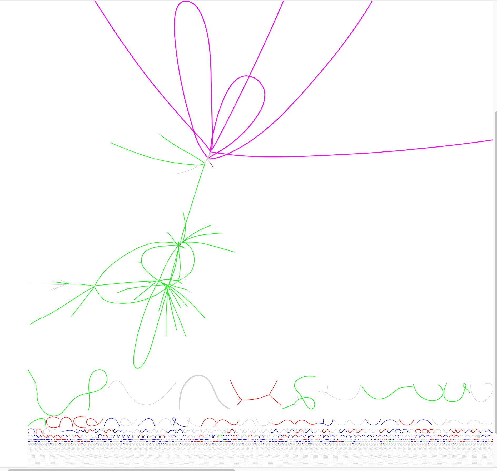

# Exploring assembly graphs

## Install bandage onto your VM

We are going to use Ryan Wick's excellent [Bandage](https://github.com/rrwick/Bandage) program to explore 
some assembly graphs from the infant gut data set. First install Bandage:

```
cd ~/repos
mkdir Bandage 
cd Bandage 
wget https://github.com/rrwick/Bandage/releases/download/v0.8.1/Bandage_Ubuntu_dynamic_v0_8_1.zip
unzip Bandage_Ubuntu_dynamic_v0_8_1.zip
cp Bandage ~/bin
```

## Now get two example example assembly graphs

We constructed two coassembly graphs from the first seven 1M subsampled infant gut samples.

```
cd Projects/InfantGut

mkdir AssemblyGraphs

cd AssemblyGraphs 

wget https://desmantutorial.s3.climb.ac.uk/contigs_colorM.gfa
wget https://desmantutorial.s3.climb.ac.uk/high_res_colorM.gfa
```

Start up Bandage:
```
Bandage
```

Open up the first of these files contigs_colorM.gfa in Bandage. You should see something like this:



The colors correspond to four MAGs we obtained from clustering the Spades contigs: 
* Bin3 magenta, E. faecalis
* Bin7 blue 
* Bin12 red
* Bin19 green, Staph. epidermidis

Why are some of the bins fragmented?

Can you find any contigs that are misassigned

Locate these two contigs with the search feature:

*NODE_55_length_32977_cov_19.323249
*NODE_327_length_8496_cov_5.646014

These correspond to contigs annotated to the single-copy core gene COG0060 in Bin19. Why are there two of them? 
Try blasting the sequences against the NCBI.

Now open up the file high_res_colorM.gfa

And find these nodes. Corresponding to COG0016 in Bin19:
* start 2816027
* end 2524601

You should be able to determine that at least two strains are present from the variant bubbles in the graph.

This is what the STRONG pipeline resolves into strains. This is the output for COG0016 in this case. For this bin we 
predict two strains confidently.

 
